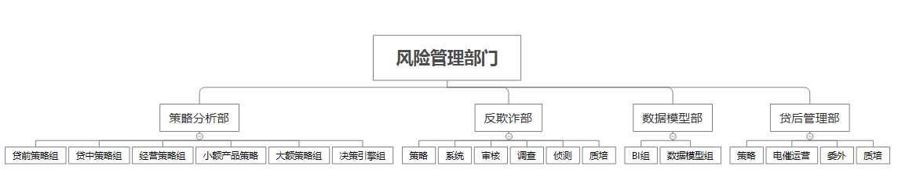

# Something-About-Risk-Management
对**个人信贷业务风险管理**的一些总结

## 互联网金融贷款公司业务指标
   注册数,完件数,授信数,放款数,坏账率,审批效率

## 风险管理部门的组织架构(某大型互金公司)

## 产品形态
APP  
包括: 个人信用贷款(无消费场景,直接提现), 商品分期(有消费场景), 虚拟信用卡(不限制消费场景,个人转账也可使用,但是不可提现)

无场景贷款额度:
- 正常 
- 大额\[20000, 200000], 可能被人工降额,一般最低可能降到18000
- 小额\[500, 4000]

商品分期额度: \[1000, 10000]

## 术语解释
禁申期:

## 贷前风控主要决策内容:
1. 是否通过授信?
2. 通过授信, 风险定价?
3. 通过授信, 风险定价, 产品定价(基于风险定价适当加价,在尽量不降低动支的情况下,提高用户利息,从而提高公司收益.需要找到对利息不敏感的人群)

## 贷前风控关键X变量
- 大额
  
## 贷中风控主要决策内容:
1.交易风控(交易拒绝规则)
2.提额风控(提额规则)
