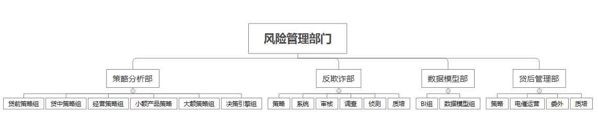

# Something-About-Risk-Management
对**个人信贷业务风险管理**的一些总结

## 风险管理部门的组织架构(某大型互金公司)

### 策略分析部
- 贷前策略组
- 贷中策略组
- 经营策略组
- 小额产品策略
- 大额策略组
- 决策引擎组

### 反欺诈部
- 策略
- 系统
- 审核
- 调查
- 侦测
- 质培

### 数据模型部
- BI组
- 数据模型组

### 贷后管理部
- 贷后策略
- 电催运营
- 委外
- 质培
